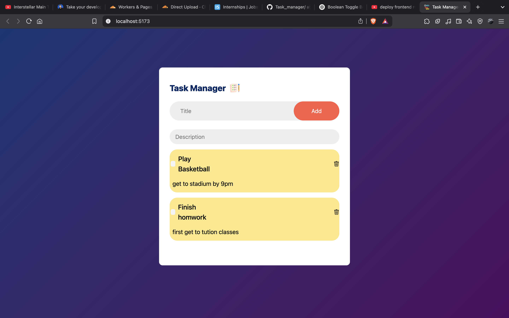

# **Task Manager Application**  

## **📝 Overview**  
This is a **Task Manager Application** built using **React** for the frontend and **Hono** for the backend. The app allows users to **add, edit, delete, and mark tasks as completed**. The backend uses **Prisma with PostgreSQL** for database management.  

---

## **🚀 Tech Stack**  
### **Frontend:**  
- React  
- Tailwind CSS  
- Axios (for API calls)  

### **Backend:**  
- Hono (Fast & Lightweight Web Framework)  
- Prisma (ORM for Database)  
- PostgreSQL (Database)  
- Cloudflare Workers (Optional for deployment)  

---

## **📌 Features**  
✅ Add new tasks  
✅ Edit task title & description  
✅ Mark tasks as completed/uncompleted  
✅ Delete tasks  
✅ Fetch & store tasks in a PostgreSQL database  

---

## **⚙️ Installation & Setup**  

### **1️⃣ Clone the Repository**  
```sh
git clone https://github.com/kushvendar/task_manager.git
cd task_manager
```
### **3️⃣ Frontend Setup (React + Tailwind)**  
#### **Install Dependencies**  
```sh
cd frontend
npm install
```
#### **Start React Development Server**  
```sh
npm run dev
```
Frontend will run at: **`http://localhost:5173`**  
Backend is already deployed at: **`https://backend.jangidkush1234.workers.dev`**

---

## 📸 Screenshot



## **🛠 API Endpoints (Hono Backend)**  
| Method | Endpoint             | Description                      |
|--------|----------------------|----------------------------------|
| GET    | `/api/v1/task`       | Get all tasks                   |
| POST   | `/api/v1/task`       | Create a new task               |
| PUT    | `/api/v1/task/:id`   | Update task title/description   |
| PATCH  | `/api/v1/task/:id`   | Toggle task completion status   |
| DELETE | `/api/v1/task/:id`   | Delete a task                   |


